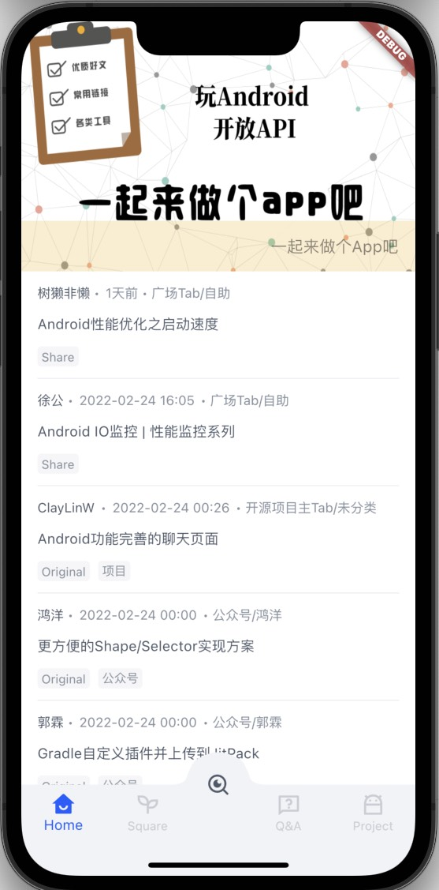
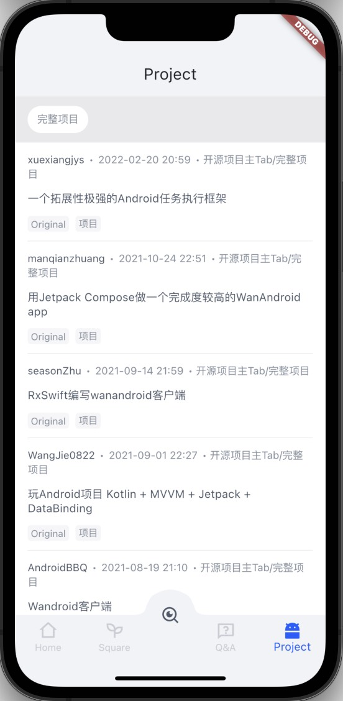
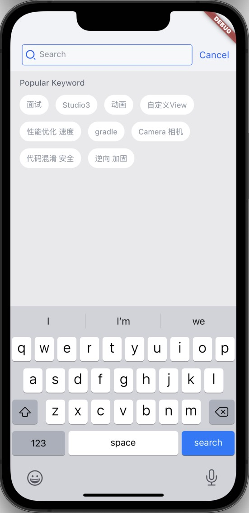
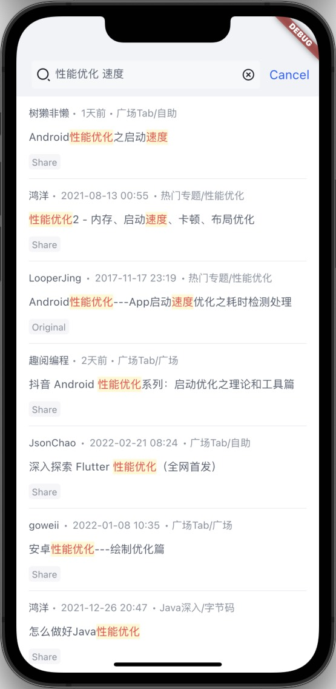
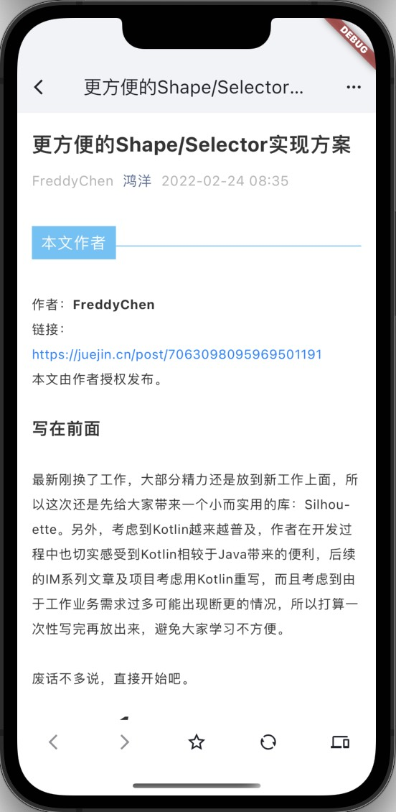

> 使用[Flutter](https://flutter.dev)和[玩Android](https://wanandroid.com/)开放API开发的App。

**[文章介绍](https://juejin.cn/post/7066681530776551455)**
# 说明
该项目有较强的个人学习性质，会跟随我自己学习和工作的情况后续视情况更新，欢迎大家共同参考一起学习
# 展示
|  |  |  |
| ---------------------- | ---------------------- | ---------------------- |
|  |  |  |
|  |  |  |
# 使用
```
1. flutter pub get
2. flutter pub run build_runner build
3. flutter run
```
# 感谢
- [openjmu](https://github.com/openjmu/OpenJMU)
- [fun_android_flutter](https://github.com/phoenixsky/fun_android_flutter)
