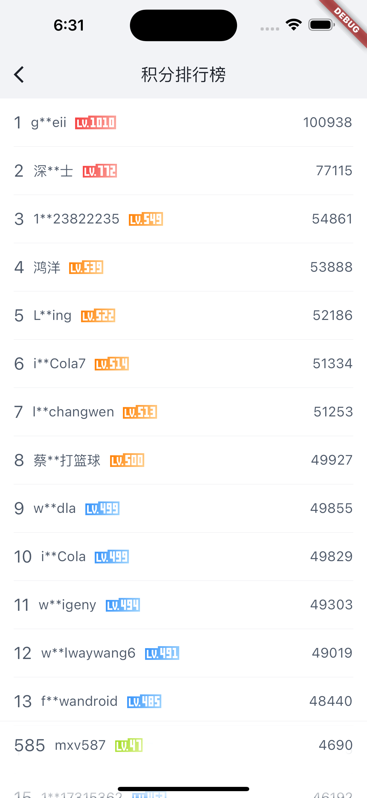

> 使用[Flutter](https://flutter.dev)和[玩Android](https://wanandroid.com/)开放API开发的App。

**[文章介绍](https://juejin.cn/post/7066681530776551455)**

# 说明

该项目有较强的个人学习性质，会跟随我自己学习和工作的情况后续视情况更新，欢迎大家共同参考一起学习

# 展示

|  |  |  |
| --- | --- | --- |
|  |  |  |
|  |

# 使用

当前使用的Flutter版本`3.10.0(stable)`

> 国际化方案使用了[intl](https://pub.flutter-io.cn/packages/intl)，请确保在编辑器中已经安装Flutter Intl插件，笔者使用的是VSCode[插件下载地址](https://marketplace.visualstudio.com/items?itemName=localizely.flutter-intl)，其他IDE搜索`Flutter Intl`下载

```shell
flutter pub get
flutter pub run build_runner build --delete-conflicting-outputs
flutter run
```

开发时可以使用
```shell
flutter pub run build_runner watch
```
来监听 freezes , riverpod_generator 等的变化自动生成代码

# 感谢

- [openjmu](https://github.com/openjmu/OpenJMU)
- [fun_android_flutter](https://github.com/phoenixsky/fun_android_flutter)
- `assets/images`文件夹下的图片源自[小假哥](https://www.iconfont.cn/user/detail?uid=4193520&nid=8N7pZVovdwFv)
